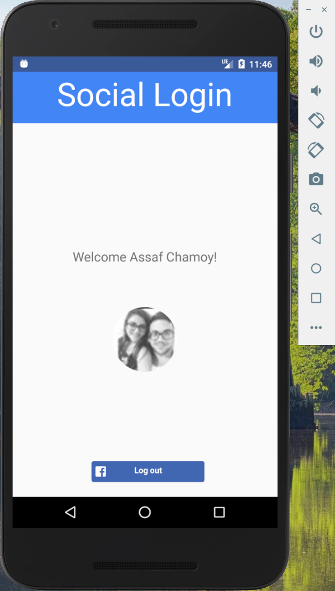

# Social login with Facebook and Google via React Native


A simple application that demonstrates how to properly use Facebook and Google Services,  
How to retrieve data, and how to connect them to your Firebase account.

**Note that the application is currently developed for android devices.**

## Getting Started

These instructions will get you a copy of the project up and running on your local machine for development and testing purposes. 
See "Deployment" for notes on how to deploy the project on a live system.

### Prerequisites

* Download and install "Android studio" on your local machine. 

**NOTE: This step could take some time depending on your machine and your internet connection.**
* After the installation of android studio, install all of the packages mentioned on the [offical React Native website](https://facebook.github.io/react-native/docs/getting-started.html),  
 Hit *'building projects with react native'* tab,
and make sure you carefully walk through the instructions.

You should now have access to a fully functioning AVD on which we are going to run our application.

* Download [vsCode](https://code.visualstudio.com/) if you havn't yet. It is a light-weight, yet powerful, IDE which I recommend.   
(You can skip this step if you have another preference of IDE.)

At this time, you should be all set and ready to move forward to the installation stage:

* Make sure [Node.js](https://nodejs.org/en/) is installed on your machine, as it is mandatory for our project to run. 


### Installing

First, download the project and open it with "vsCode" (or any other IDE of your choice).
Next, open a command line and navigate to the project folder you have downloaded.  
(You may use the integrated terminal if you want)

e.g: 
```
cd desktop 
cd nativeSocialLogin
```
Next hit the following command :
```
npm install
```
You'll notice a folder named `node_modules` added to the project files, Your project file explorer should look like this :


You should now be able to start the application.

## Running the app

Go ahead and open `Anroid Studio` and choose the AVD manager icon at the top bar :


If you have configured your AVD properly you should get a window that looks like this:


Go ahead and click the  at the *Actions* section and your AVD should pop up:


Go back to your previous command prompt. If you closed it, open it up again, navigate to your project directory 
and put the following command :
```
react-native run-android
```
This should compile the `.apk` file which will be installed on your AVD.  
If you configured everything correctly, the terminal will print something like this:

 
**Notice**: *The command above should open up another command line in the background.  
This is the server in which your app will run from, otherwise it will not work.  
If you happen to face such an issue, type in again `react-native run-android` in the terminal and it should resolve.*


The app should then run on your AVD looking like this :  


## Deployment

In order to install the app on a physical android device, you need the `.apk` file. This is the installation file for android applications.
I provided the project's `.apk` file in the project's root directory.  
Now, in order to be able to install it on your android device you need to transfer the `.apk` installation file to your device by either simply put it in the phone's sd-card, email it to yourself or any other preferred method.  
Once the file is in your device, simply navigate to it and click it. the installation wizard will pop up and ask you for permission to install it so go ahead and accept, the device might block the installation due to unknown resources  
(installation is disabled on your phone by default) - And the installation will guide you to the settings where you can activate installation from unknown resources by a click of a button.

Thats it! now you can access the application through your mobile device.

## Built With

* [React-Native-fbsdk](https://github.com/facebook/react-native-fbsdk) - The official sdk for react native by Facebook.
* [React-Native-googleSignin](https://github.com/react-native-community/react-native-google-signin) - The offical sdk for react native by Google.
* [React-Native-cli](https://www.npmjs.com/package/react-native-cli) - Used to build the react-native app initially.
* [npm](https://www.npmjs.com/) - Used to install the packages and dependencies for the project to work.
* [Android Studio](https://developer.android.com/studio/) - Provides a convenient installation of android `sdk` and `AVD` management, as well as configuring android root elements and settings of our project.
* [VsCode](https://code.visualstudio.com/) - As a preferred code editor.

## App screens

 ### Default welcome screen: 


 ###  Facebook login modal: 


 ###  Google login modal: 


 ###  Welcome Facebook homepage: 



 ###  Welcome Google homepage: 


 

## Important note

* If you intend to develop an application which implements the services used here, I strongly suggest to follow accurately along the long detailed documents provided in the official websites of each service, as you will have a difficult time otherwise. 

## Useful Links
* [Offical React Native website](https://facebook.github.io/react-native/docs/getting-started.html) 
* [Official react-native-fbsdk github](https://github.com/facebook/react-native-fbsdk)
* [Official react-native-googleSignin](https://github.com/react-native-community/react-native-google-signin)
* [Officail Firebase website](https://firebase.google.com/)
* [Officail vsCode website](https://code.visualstudio.com/)
* [Official android studio website](https://developer.android.com/studio/)
* [Official react-native-cli github](https://www.npmjs.com/package/react-native-cli)
* [Official react-native website](https://facebook.github.io/react-native/)


## Final
In conclusion, please make sure to follow the development comments I wrote in the `main.js` file to fully understand the functionality and the logic behind each function.

